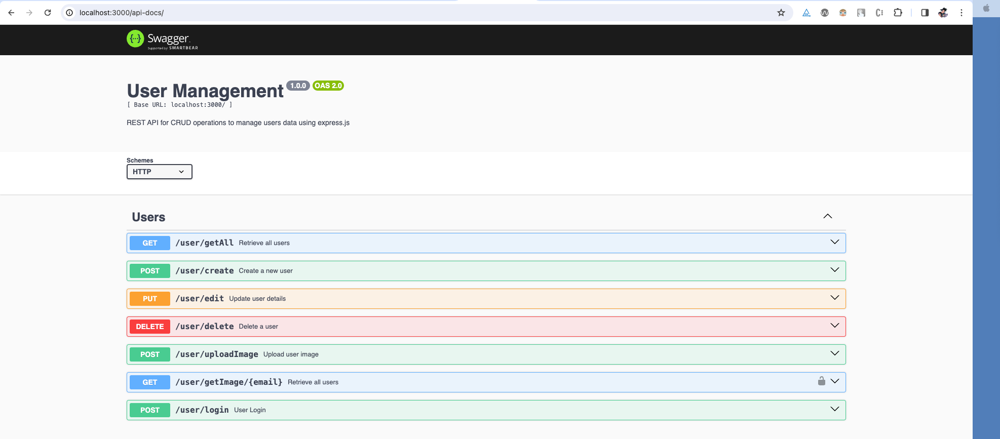

## Rest API for User Management

- Created the rest api's for managing the user details.

## Tech Stack 

- Web Framework - Express js
- ORM - Mongoose
- Database - MongoDB

## Restful methods

- GET
- POST
- PUT
- DELETE

## Screenshot of Swagger Documentation

## Endpoints routes

- /user/getAll
    - Gets a list of all users, including their full names, email addresses, and hashed passwords.
- /user/create
    - Creates a new user with full name, email, and password. Includes validation for email and enforces strong password rules.
- /user/edit
    - Updates an existing user\'s full name and password based on the provided email. Email cannot be updated.
- /user/delete
    - Deletes a user by email.
- /user/uploadImage
    - Uploads an image for a user and stores the image path in the database.
- /user/getImage/{email}
    - Gets a list of images for the respective user
- /user/login
    - Authenticate user credentials and generate JWT token if valid and set the cookie
